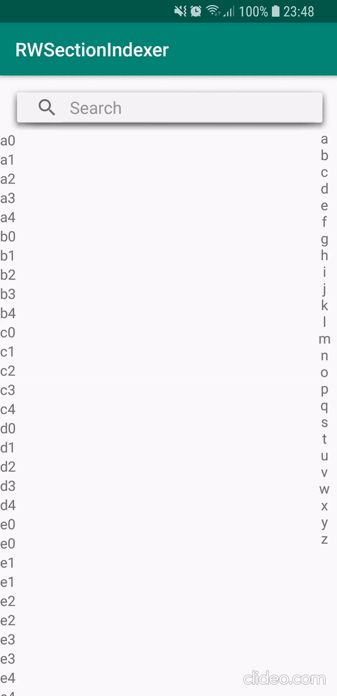

# RecyclerView Section Indexer Sample

This is an example app for creating search-responsive indexer for Recyclerview.
I created this based on the following sources (please check them out):

* https://github.com/reddit/IndicatorFastScroll
* https://android.jlelse.eu/fast-scrolling-with-recyclerview-2b89d4574688

Merged and simplifed the sources above, so I hope it is easier to understand, rerpoduce and modify it to everyone's needs.

I'm using the SectionIndexer interface for the adapter, but since it is not supported for Recyclerview, there is a custom
solution using it.

## Features
 * Simple solution
 * Responsive to search results
 * Commented
 
 Hope it helps if you are stuck with this as I was. :)
